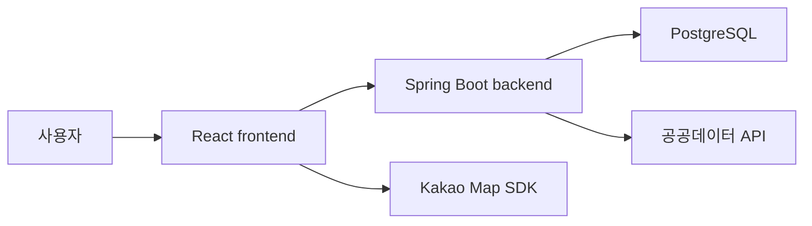
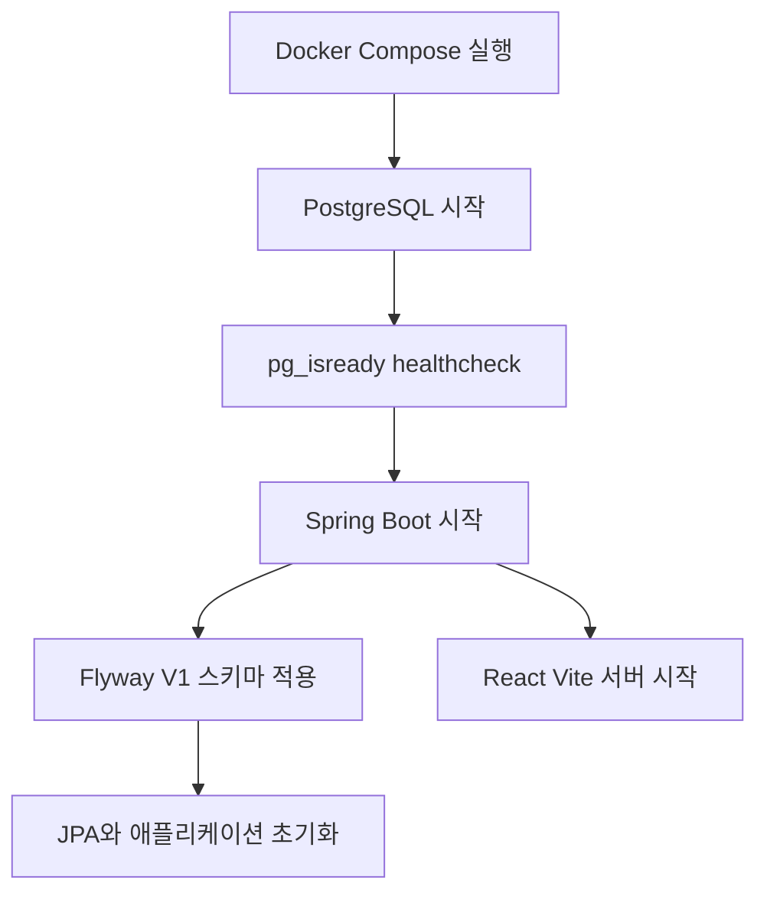
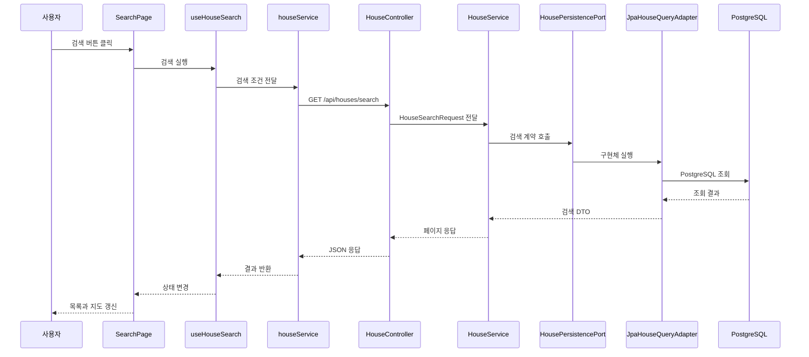

# NoHome 프로젝트 파이프라인 학습 가이드

이 문서는 NoHome의 모든 구현 세부를 한 번에 설명하지 않는다.

처음에는 아래 두 가지만 이해하는 것이 목표다.

1. Docker Compose가 애플리케이션을 어떤 순서로 실행하는가?
2. 사용자의 검색 요청이 프론트엔드, 백엔드, 데이터베이스를 어떻게 왕복하는가?

세부 구현은 문서 마지막의 질문을 하나씩 선택해 확장한다.

## 현재 리팩토링 상태

현재 목표로 정했던 구조 리팩토링은 완료됐다.

- 프론트엔드: `page -> hook -> service`
- 백엔드: `controller -> application service -> persistence port -> JPA adapter`
- 데이터베이스: PostgreSQL 17
- 스키마 관리: Flyway
- 실행 환경: 루트 `docker-compose.yml` 하나
- 통합 테스트: Testcontainers PostgreSQL

여기서 완료란 더 이상 개선할 부분이 전혀 없다는 뜻은 아니다. React Router 도입, 운영용 Nginx 이미지, CI/CD 구축, 성능 튜닝은 실제 배포 단계에서 선택할 수 있는 확장 과제다. 현재 프로젝트의 구조 이해와 자소서·면접 설명에 필요한 리팩토링 범위는 마무리됐다는 의미다.

## 1. 가장 먼저 볼 전체 그림



각 구성 요소의 역할은 다음 한 문장으로 기억하면 된다.

- React는 화면을 보여 주고 사용자 입력과 화면 상태를 관리한다.
- Spring Boot는 요청을 검증하고 유스케이스를 실행한다.
- PostgreSQL은 회원, 공지, 관심 지역, 주택과 거래 정보를 저장한다.
- 공공데이터 API는 DB에 없는 실거래 데이터를 보충한다.
- Kakao Map SDK는 검색 결과를 지도에 표시한다.

## 2. 서비스가 켜지는 흐름

루트에서 다음 명령을 실행한다.

```powershell
docker compose up -d --build
```

그러면 다음 순서로 실행된다.



핵심은 **백엔드가 DB보다 먼저 시작하지 않는 것**이다. Compose는 PostgreSQL의 healthcheck가 성공한 뒤 백엔드를 시작한다.

백엔드가 시작되면 Hibernate가 테이블을 임의로 만드는 것이 아니라 Flyway가 `V1__initial_schema.sql`을 실행한다. 따라서 개발 환경과 테스트 환경이 같은 스키마 이력을 사용한다.

## 3. 검색 요청 한 번의 흐름

사용자가 검색 화면에서 지역과 거래월을 선택하고 검색 버튼을 누른 상황을 보자.



이 흐름에서 가장 중요한 경계는 세 가지다.

### 화면은 HTTP 세부사항을 모른다

`SearchPage`는 화면을 그린다. 검색 상태와 실행 순서는 `useHouseSearch`가 담당하고 실제 HTTP 호출은 `houseService`가 담당한다.

### 컨트롤러는 비즈니스 흐름을 실행하지 않는다

`HouseController`는 HTTP 요청을 `HouseSearchRequest`로 받고 결과를 공통 API 응답으로 감싼다. 검색 조건 검증, 자동 수집 판단, DB 조회 순서는 `HouseService`와 관련 서비스가 담당한다.

### 서비스는 JPA 구현체를 직접 알지 않는다

`HouseService`는 `JpaHouseQueryAdapter`가 아니라 `HousePersistencePort`에 의존한다. Port는 서비스가 필요로 하는 저장소 계약이고 Adapter는 그 계약을 PostgreSQL과 JPA로 구현한다.

## 4. DB에 검색 데이터가 부족하면

주택 검색에는 일반 CRUD보다 한 단계가 더 있다.

1. `HouseSearchConditionFactory`가 검색 조건을 정규화하고 검증한다.
2. `HouseAutoImportCoverage`가 필요한 기간의 데이터가 DB에 있는지 판단한다.
3. 데이터가 있으면 PostgreSQL을 조회한다.
4. 데이터가 부족하고 자동 수집이 활성화돼 있으면 공공데이터 API를 호출한다.
5. 사용자는 수집한 결과를 받고, 데이터는 별도 저장 흐름을 통해 PostgreSQL에 반영된다.

비동기 저장에서도 트랜잭션이 확실히 적용되도록 `PublicDataBatchPersistService`가 명시적인 트랜잭션 경계를 관리한다. 요청 상태, 실제 데이터 저장, 실패 상태 기록은 서로의 롤백에 휩쓸리지 않도록 분리돼 있다.

이 부분은 처음 읽을 때 내부 SQL까지 이해할 필요는 없다. 우선 **검색 서비스가 DB 조회와 외부 데이터 보충을 조율한다**는 것만 기억하면 충분하다.

## 5. 폴더를 읽는 순서

처음부터 모든 파일을 열지 말고 검색 기능 하나만 아래 순서로 따라간다.

```text
Frontend/src/pages/search/SearchPage.jsx
  -> Frontend/src/hooks/useHouseSearch.js
  -> Frontend/src/services/houseService.js
  -> Backend/.../house/controller/HouseController.java
  -> Backend/.../house/service/HouseService.java
  -> Backend/.../house/persistence/HousePersistencePort.java
  -> Backend/.../house/persistence/JpaHouseQueryAdapter.java
```

한 기능의 세로 흐름을 먼저 이해한 뒤 회원, 공지, 관심 지역으로 넓히는 편이 쉽다. 모든 controller를 읽고 모든 service를 읽는 가로 방식은 각 코드가 왜 필요한지 연결하기 어렵다.

## 6. 면접에서 우선 설명할 수준

처음에는 다음 정도만 자신의 말로 설명할 수 있으면 된다.

> NoHome은 React, Spring Boot, PostgreSQL로 구성된 모노레포입니다. 프론트엔드는 page, hook, service로 화면·상태·통신 책임을 분리했고, 백엔드는 controller, application service, persistence port, JPA adapter 순서로 요청을 처리합니다. Docker Compose가 PostgreSQL의 정상 상태를 확인한 뒤 백엔드를 시작하며, Flyway가 스키마를 버전 관리합니다. 복잡한 주택 검색은 PostgreSQL native SQL을 JPA adapter 안에 캡슐화했고 실제 PostgreSQL 기반 Testcontainers 테스트로 검증했습니다.

암기하기보다 위 문장의 각 선택에 대해 “왜?”를 답할 수 있도록 질문을 이어가는 것이 목표다.

## 7. 다음 질문 목록

아래에서 궁금한 질문 하나만 선택해서 물어보면 된다.

### 먼저 이해할 질문

1. 왜 React에서 Page가 API를 직접 호출하지 않고 Hook과 Service를 거치는가?
2. 백엔드 Controller와 Service의 책임은 정확히 어디서 나뉘는가?
3. Persistence Port가 있는데 왜 JPA Repository도 필요한가?
4. Docker Compose의 `depends_on`과 healthcheck는 각각 무슨 역할인가?
5. Flyway와 Hibernate `ddl-auto`는 무엇이 다르며 왜 Flyway를 선택했는가?

### 그다음 확장할 질문

6. 주택 검색에서 DB 데이터 부족을 어떻게 판단하고 공공데이터를 가져오는가?
7. 비동기 저장에서 트랜잭션을 따로 관리해야 하는 이유는 무엇인가?
8. JPA를 쓰면서 native SQL을 사용해도 되는가?
9. JWT 쿠키는 로그인부터 API 인증까지 어떻게 이동하는가?
10. Testcontainers를 사용한 테스트가 H2 테스트보다 신뢰할 수 있는 이유는 무엇인가?

### 지금은 깊게 파지 않아도 되는 내용

- PostgreSQL 실행 계획 세부 튜닝
- Docker 이미지 레이어 최적화
- Spring 프록시의 내부 구현 전체
- React 렌더링 엔진 내부 구조
- 운영 환경의 오케스트레이션과 무중단 배포

이 내용들은 현재는 “어떤 문제를 해결하는 기술인지”만 알면 충분하다. 먼저 한 번의 요청이 각 계층을 통과하는 이유를 자신의 말로 설명하는 것이 더 중요하다.

## 첫 번째 권장 질문

> 검색 버튼을 눌렀을 때 `SearchPage`가 바로 백엔드를 호출하지 않고 `useHouseSearch`와 `houseService`를 거치도록 만든 이유는 무엇인가?

