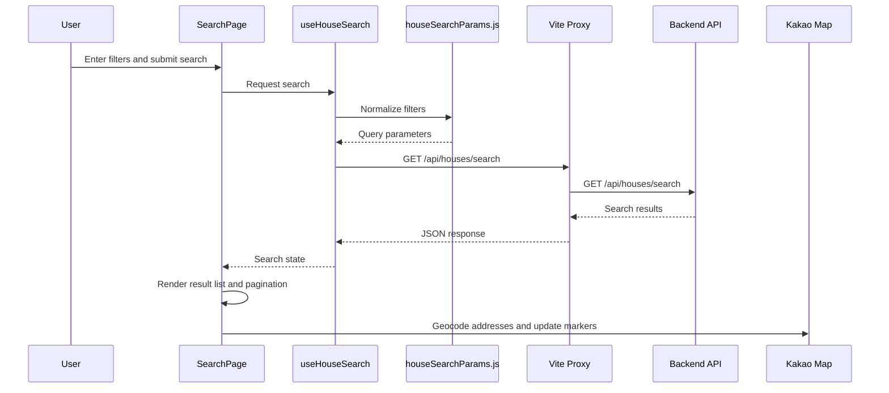

# NoHome Frontend

NoHome의 React/Vite 프론트엔드입니다. 사용자는 서울 아파트 실거래가를 검색하고, 결과 목록과 Kakao Map 지도에서 거래 위치를 확인할 수 있습니다.

## Tech Stack

- React
- Vite
- JavaScript
- Kakao Map JavaScript SDK

## Run Locally

루트 `.env.example`을 기준으로 루트 `.env`를 만든 뒤 실행합니다.

```powershell
cd ..
Copy-Item .env.example .env
docker compose up -d --build
```

프론트엔드만 개발 서버로 실행할 때는 다음 명령을 사용합니다.

```powershell
cd Frontend
npm install
npm run dev
```

## Environment Variables

프론트엔드에서 사용하는 값은 `VITE_` prefix가 필요합니다.

```text
VITE_KAKAO_MAP_API_KEY=
VITE_API_PROXY_TARGET=http://localhost:8080
```

- `VITE_KAKAO_MAP_API_KEY`: Kakao Map JavaScript SDK key
- `VITE_API_PROXY_TARGET`: Vite 개발 서버가 `/api` 요청을 전달할 Backend 주소

실제 키와 비밀번호는 `.env`에만 작성하고 Git에 커밋하지 않습니다.

## Source Structure

```text
src/
  App.jsx                         provider와 최상위 layout 조립
  components/
    chat/                         AI Assistant UI 컴포넌트
    layout/                       앱 공통 레이아웃
  pages/
    search/                       검색 페이지와 페이지 전용 컴포넌트
    account/                      회원 계정 페이지
    admin/                        관리자 페이지
    notice/                       공지사항 페이지
  hooks/                          검색, 지도, 회원, 공지, 관심지역 상태 관리
  services/                       API client, domain service, agent command service
  context/                        앱 전역 context
  utils/                          표시 포맷터, 채팅 패널, UI helper
  styles/                         base/layout/search/result/map 등 CSS 분리
  houseSearchParams.js            검색 조건 정규화와 API query 생성
  houseSearchParams.test.js       검색 파라미터 생성 테스트
  main.jsx                        React 진입점
  style.css                       CSS import 진입점
```

## Main Flow



## Verification

```powershell
npm test
npm run build
```
