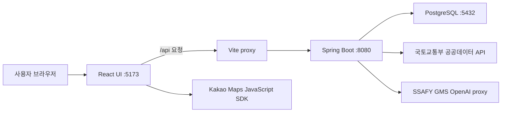
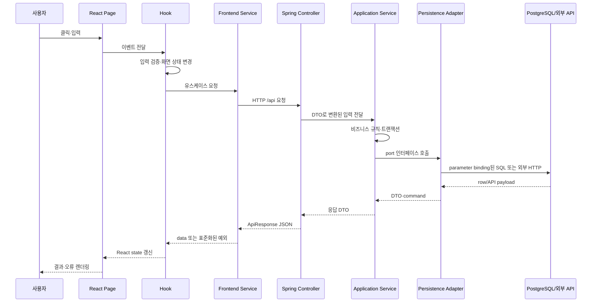
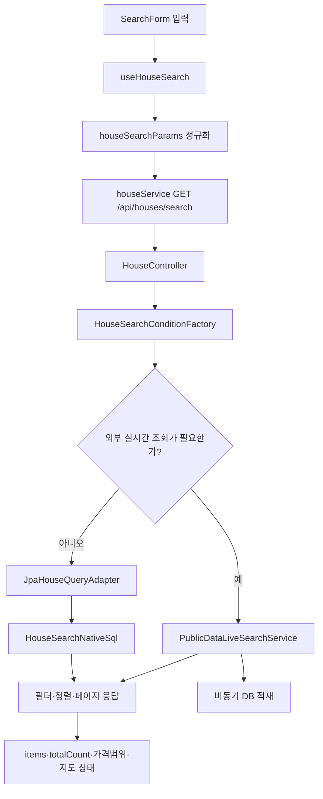

# NoHome 프로젝트 실행 및 요청 처리 파이프라인

이 문서는 NoHome을 처음 보는 개발자가 “어떻게 실행되고, 사용자 요청이 어디를 지나며, 데이터가 어떤 형태로 바뀌는가”를 실제 코드 기준으로 이해하기 위한 안내서다. 마지막에는 이 구조와 관련된 백엔드 면접 질문에 답할 수 있도록 설계 근거와 트레이드오프를 정리한다.

기준 소스는 Spring Boot 3.5.9·Java 17의 [Backend](../Backend/)와 React 19·Vite 5의 [Frontend](../Frontend/)다.

## 1. 시스템 한눈에 보기



- Frontend는 화면, 화면 상태를 조율하는 hook, HTTP를 담당하는 service로 나뉜다.
- Backend는 Controller, application service, persistence port, JPA adapter 순서로 책임을 분리한다.
- PostgreSQL은 회원·인증·공지·관심 지역과 조회를 위해 적재된 부동산 데이터를 보관한다.
- 공공데이터가 DB에 없을 때에는 외부 API 응답을 먼저 사용자에게 반환하고, 같은 데이터를 비동기로 적재할 수 있다.
- AI는 답변 텍스트 또는 Frontend가 실행할 구조화 명령을 반환한다. 실제 화면 조작 권한은 브라우저에 남는다.

주요 진입점은 [docker-compose.yml](../docker-compose.yml), [HomeApplication](../Backend/src/main/java/com/ssafy/home/HomeApplication.java), [Frontend main](../Frontend/src/main.jsx)이다.

## 2. 서버 기동 파이프라인

### Docker Compose로 전체 실행

`docker compose up -d --build`를 실행하면 [docker-compose.yml](../docker-compose.yml)에 따라 다음 순서로 준비된다.

1. Compose가 루트 `.env`를 읽어 DB 계정, 외부 API 키와 JWT 설정을 치환한다.
2. PostgreSQL 17 컨테이너가 시작되고 `pg_isready` health check가 성공할 때까지 기다린다.
3. Backend 이미지가 빌드된다. [Backend Dockerfile](../Backend/Dockerfile)은 JDK 단계에서 Maven Wrapper로 의존성을 받고 테스트를 제외한 package를 수행한다.
4. Backend 런타임 단계는 생성된 실행 JAR만 JRE 이미지로 복사해 `java -jar app.jar`로 기동한다.
5. Frontend 이미지가 [Frontend Dockerfile](../Frontend/Dockerfile)에 따라 `npm ci`로 정확한 lock 파일 버전을 설치하고 Vite 개발 서버를 `0.0.0.0:5173`에 연다.
6. Vite는 `/api` 요청을 Compose 내부 주소 `http://backend:8080`으로 전달한다.

`depends_on`은 Backend가 DB health check 이후 시작하게 하지만, 애플리케이션 수준의 모든 장애를 해결하지는 않는다. 운영 환경에서는 재시작 정책, readiness/liveness probe와 관측 도구가 추가로 필요하다.

### Spring Boot 내부 기동

Backend 프로세스가 시작되면 다음 일이 일어난다.

1. `@SpringBootApplication`이 `com.ssafy.home` 아래 component를 탐색하고 자동 설정을 적용한다.
2. [application.properties](../Backend/src/main/resources/application.properties)가 환경 변수와 선택적 `.env`, 로컬 설정을 결합한다. 환경 변수가 기본값보다 우선한다.
3. HikariCP가 PostgreSQL 연결 풀을 구성한다. 연결 대기 기본값은 2초다.
4. Flyway가 [V1 migration](../Backend/src/main/resources/db/migration/V1__initial_schema.sql)을 확인하고 적용한다.
5. Hibernate는 `ddl-auto=none`이므로 스키마를 임의로 생성·수정하지 않는다. `open-in-view=false`라서 영속성 접근은 service/adapter 경계 안에서 끝내야 한다.
6. AI 키가 없으면 [AiKeyEnvironmentPostProcessor](../Backend/src/main/java/com/ssafy/home/ai/config/AiKeyEnvironmentPostProcessor.java)가 Spring AI 모델 자동 설정만 비활성화한다. 부동산·회원 기능은 계속 기동한다.
7. `prod` profile에서는 [ProductionSecurityValidator](../Backend/src/main/java/com/ssafy/home/common/config/ProductionSecurityValidator.java)가 약한 JWT secret이나 비보안 cookie 설정을 발견하면 기동을 막는다.

Flyway를 Hibernate 자동 DDL보다 우선한 이유는 스키마 변경을 코드처럼 버전 관리하고, 어느 환경에서도 같은 순서로 재현하기 위해서다. 이미 배포된 migration은 수정하지 않고 다음 버전 파일을 추가한다.

### Frontend 기동

브라우저가 `index.html`을 받으면 [main.jsx](../Frontend/src/main.jsx)가 React root에 `App`을 렌더링한다. [App.jsx](../Frontend/src/App.jsx)는 전체 기능을 조율하는 `useAppController`, 인증 Context, header와 page route를 조립한다. 별도 라우터 라이브러리 대신 controller의 `activePage` 상태로 화면을 선택한다.

Vite 개발 서버를 사용하는 현재 Dockerfile은 개발·시연에 단순하지만 정적 파일 최적화, CDN, 장기 캐시가 필요한 운영 배포 방식은 아니다. 운영에서는 `npm run build`로 만든 `dist`를 Nginx나 정적 호스팅에서 제공하는 구성이 일반적이다.

## 3. 모든 사용자 요청의 공통 경로



Backend 응답은 [ApiResponse](../Backend/src/main/java/com/ssafy/home/common/response/ApiResponse.java)의 `success`, `message`, `data` 형태로 통일된다. 도메인 예외는 [GlobalExceptionHandler](../Backend/src/main/java/com/ssafy/home/common/response/GlobalExceptionHandler.java)가 400·401·403·404·409·502·503·504 같은 HTTP 상태로 번역한다.

[Frontend apiClient](../Frontend/src/services/apiClient.js)는 JSON을 파싱하고 HTTP 실패 또는 `success=false`를 JavaScript 예외로 바꾼다. `credentials: 'include'`가 있어 브라우저가 인증 cookie를 함께 보낸다. 주택 검색은 요청 시간이 길 수 있어 별도의 `AbortController` timeout을 사용한다.

## 4. 대표 흐름 A — 주택 검색



1. [useHouseSearch](../Frontend/src/hooks/useHouseSearch.js)는 지역과 거래월을 검증하고 기존 결과·지도 marker를 비운 뒤 loading 상태를 연다.
2. [houseSearchParams](../Frontend/src/houseSearchParams.js)가 `YYYY-MM`을 `YYYYMM`으로 바꾸고, 서울 자치구를 법정동 코드로 해석하며 거래 유형에 맞지 않는 가격 필터를 제외한다.
3. [houseService](../Frontend/src/services/houseService.js)가 query string을 만들어 `/api/houses/search`를 호출한다. 전체 보기에서는 첫 페이지 결과의 total을 기준으로 나머지 페이지를 병렬 요청하되 추가 요청의 자동 import는 끈다.
4. [HouseController](../Backend/src/main/java/com/ssafy/home/house/controller/HouseController.java)는 Spring `@ModelAttribute` binding으로 query parameter를 `HouseSearchRequest` record에 담는다.
5. `HouseSearchConditionFactory`가 공백 제거, 페이지·크기 제한, 정렬·거래 유형 검증, 가격 범위와 거래월 정규화를 수행해 내부 `HouseSearchCondition`을 만든다. 외부 입력 DTO와 신뢰 가능한 내부 조건을 분리한 것이다.
6. [HouseService](../Backend/src/main/java/com/ssafy/home/house/service/HouseService.java)는 조회 경로를 결정한다.
   - 특정 지역·월의 DB coverage가 부족하면 공공데이터를 실시간 수집한다.
   - 실시간 row는 응답 DTO로 변환해 먼저 필터·정렬·페이지 처리한다.
   - 같은 row는 [PublicDataBatchPersistService](../Backend/src/main/java/com/ssafy/home/publicdata/service/PublicDataBatchPersistService.java)의 고정 thread pool에서 별도 트랜잭션으로 지역→주택→거래 순서로 적재한다.
   - DB 조회 경로에서는 `HousePersistencePort`를 통해 JPA adapter를 호출한다.
7. [JpaHouseQueryAdapter](../Backend/src/main/java/com/ssafy/home/house/persistence/JpaHouseQueryAdapter.java)는 복합 검색을 native SQL로 실행한다. [HouseSearchNativeSql](../Backend/src/main/java/com/ssafy/home/house/persistence/HouseSearchNativeSql.java)은 허용된 정렬 문자열만 SQL 조각으로 선택하고 값은 named parameter로 binding한다.
8. DB `Object[]` row는 `HouseRowMappers`에서 응답 record로 변환되고, service가 `items`, page, total, 가격 범위와 import metadata를 묶는다.
9. Frontend hook은 이전 요청과 뒤늦게 도착한 응답이 섞이지 않도록 request id를 비교한 뒤 state와 Kakao Map marker를 갱신한다.

중요한 데이터 변화는 다음과 같다.

```text
화면 문자열(2026-06, 강남구, 10억원)
-> query parameter(202606, 11680, 100000)
-> HouseSearchRequest
-> 검증된 HouseSearchCondition(page/size/offset 포함)
-> SQL parameter 또는 공공데이터 요청
-> DB/API row
-> HouseSearchResultResponse
-> ApiResponse JSON
-> React items와 지도 marker
```

## 5. 대표 흐름 B — 로그인과 인증 요청

1. `useMemberAccount`가 [memberService](../Frontend/src/services/memberService.js)의 `POST /api/auth/login`을 호출한다.
2. [MemberController](../Backend/src/main/java/com/ssafy/home/member/controller/MemberController.java)는 email과 password를 `MemberAuthService`로 전달한다.
3. `MemberService`가 회원을 찾고 [PasswordHasher](../Backend/src/main/java/com/ssafy/home/member/service/PasswordHasher.java)의 BCrypt로 비밀번호를 비교한다. 비밀번호 원문은 DB에 저장하지 않는다.
4. [MemberAuthService](../Backend/src/main/java/com/ssafy/home/member/auth/MemberAuthService.java)는 한 트랜잭션 안에서 access/refresh JWT를 발급하고 refresh token의 SHA-256 hash와 만료 시각을 DB에 저장한다.
5. [AuthCookieService](../Backend/src/main/java/com/ssafy/home/member/auth/AuthCookieService.java)가 두 token을 HttpOnly, SameSite=Lax cookie로 응답한다. access cookie 경로는 `/api`, refresh cookie는 `/api/auth`로 제한한다.
6. 이후 보호 요청은 [JwtAuthenticationInterceptor](../Backend/src/main/java/com/ssafy/home/member/auth/JwtAuthenticationInterceptor.java)가 access token의 HMAC-SHA256 서명, type과 만료를 검증하고 member id를 request attribute에 넣는다.
7. `@CurrentMemberId` argument resolver가 request attribute를 Controller parameter로 전달한다. interceptor가 걸리지 않은 endpoint에서는 cookie를 직접 검증하는 fallback을 사용한다.
8. access token이 만료되면 `POST /api/auth/refresh`가 refresh token을 검증하고 새 token pair로 회전한다. DB의 기존 hash와 일치할 때만 교체하므로 이미 사용되거나 폐기된 refresh token의 재사용을 막는다.
9. 로그아웃·회원 탈퇴는 저장된 refresh token을 제거하고 cookie를 만료시킨다.

JWT는 매 요청마다 서버 session을 조회하지 않아 수평 확장이 쉽지만, 이미 발급된 access token의 즉시 폐기가 어렵다. 이 프로젝트는 access token을 15분으로 짧게 두고 refresh token은 DB에서 회전·폐기하는 절충을 사용한다.

## 6. 대표 흐름 C — AI 답변과 화면 명령

1. `useChatConversation`이 message, 대화 id, 현재 검색 조건, 페이지와 지원 capability를 `POST /api/ai/assistant`로 보낸다.
2. 인증 interceptor가 로그인 회원을 확인한다.
3. [AiAssistantService](../Backend/src/main/java/com/ssafy/home/ai/assistant/AiAssistantService.java)는 빈 입력·최대 길이·AI 활성화·로그인 여부를 검증하고 회원별 rate limit과 동시 요청 제한을 적용한다.
4. Spring AI `ChatClient`에 system prompt, 최근 대화 memory와 현재 화면 상태를 전달하고 `HouseTools`, `PageActionTools`만 도구로 노출한다.
5. 결과가 일반 대화면 `type=answer`와 텍스트를 반환한다. 화면 조작 의도면 허용된 filter와 action만 담은 `type=command`를 반환한다.
6. Frontend는 command schema를 다시 검증하고 검색·페이지 이동·선택·지도 focus 같은 로컬 동작을 수행한다. LLM이 브라우저를 직접 제어하지 않는다.

[AiConfig](../Backend/src/main/java/com/ssafy/home/ai/config/AiConfig.java)의 대화 memory와 rate limit은 메모리 기반이다. 프롬프트·답변을 DB에 영속 저장하지 않는 대신 서버 재시작 시 사라지고, 여러 Backend instance 사이에서 공유되지 않는다. 다중 instance 운영이라면 Redis 같은 공유 저장소가 필요하다.

## 7. 공지와 관심 지역

- 공지: Page/hook → `/api/notices` → `NoticeController` → `NoticeService` → `NoticePersistencePort` → JPA adapter/repository → `notices` table 순서다. 쓰기 작업은 관리자 email 여부를 확인하고 트랜잭션으로 처리한다.
- 관심 지역: `interestRegionService` → `/api/interest-regions` → `InterestRegionController` → `InterestRegionService` → persistence port → `interest_regions`와 `regions` table 순서다. 회원과 지역의 FK 및 unique 제약으로 중복을 방지한다.
- 회원 수정·삭제와 공지·관심 지역 쓰기는 service가 유스케이스 경계와 트랜잭션 경계를 함께 가진다.

## 8. DB와 데이터 일관성

[V1 migration](../Backend/src/main/resources/db/migration/V1__initial_schema.sql)은 다음 핵심 table을 만든다.

- `regions` → `houses` → `house_deals`: 지역, 주택, 거래의 부모·자식 관계
- `public_data_import_batches`: 외부 API 수집 범위와 성공·실패·건수
- `members` → `member_refresh_tokens`: 회원과 회전 가능한 refresh token hash
- `members` → `notices`: 공지 작성자
- `members`·`regions` → `interest_regions`: 회원의 관심 지역 연결

FK는 존재하지 않는 부모를 참조하지 못하게 하고, unique key와 API row hash는 같은 외부 거래의 중복 적재를 막는다. 검색이 많은 `lawd_cd + deal_ymd`, `house_id + deal_date`, 거래 유형 열에는 index가 있다.

트랜잭션은 “함께 성공하거나 함께 실패해야 하는 상태 변경” 단위에 둔다. 특히 공공데이터 적재는 요청 batch 기록, 지역·주택 upsert, 거래 insert, 최종 성공 상태를 묶고, 실패 상태 기록은 `REQUIRES_NEW`로 분리해 본 작업 rollback 뒤에도 남긴다.

## 9. Maven Wrapper와 생성 파일

이 항목들은 자동 생성·다운로드되는 도구 또는 결과물이므로 파일 옆에 별도 주석을 달지 않고 여기에서만 설명한다.

| 경로 | 생성 주체와 시점 | Git 관리 |
|---|---|---|
| `Backend/mvnw`, `mvnw.cmd`, `.mvn/wrapper/*` | `mvn wrapper:wrapper` 실행 시 생성·갱신하는 실행 스크립트, bootstrap JAR와 설정 | 팀원이 같은 Maven을 쓰도록 커밋 |
| 사용자 Maven Wrapper cache | `mvnw`가 최초 실행될 때 `distributionUrl`의 Maven 3.9.9를 사용자 Maven 디렉터리에 다운로드 | 저장소 밖, 커밋하지 않음 |
| 사용자 `.m2/repository` | Maven이 `pom.xml`의 plugin과 dependency를 내려받을 때 생성 | 저장소 밖, 커밋하지 않음 |
| `Backend/target/classes` | `compile`에서 Java/resource를 빌드 | 생성물, ignore |
| `Backend/target/test-classes`, `surefire-reports` | `test`에서 test compile·실행 | 생성물, ignore |
| `Backend/target/*.jar` | `package`에서 만들고 Spring Boot plugin이 실행 JAR로 repackaging | 생성물, ignore |
| `Frontend/node_modules` | `npm install` 또는 lock 파일 기반 `npm ci`가 dependency 설치 | 생성물, ignore |
| `Frontend/.vite` | Vite 개발 서버가 dependency pre-bundle cache 생성 | 생성물, ignore |
| `Frontend/dist` | `npm run build`가 운영용 정적 asset 생성 | 생성물, ignore |
| Docker image/layer | `docker compose build`가 Dockerfile 단계별 생성 | Docker 저장소, Git 밖 |
| PostgreSQL volume | Compose가 첫 실행 때 `no-home-postgres-data` 생성 | Docker volume, Git 밖 |
| `flyway_schema_history` | Flyway가 DB에 적용 migration과 checksum 기록 | DB 운영 metadata |

Maven Wrapper 실행 순서는 “운영체제용 스크립트 선택 → wrapper 설정 읽기 → 지정 Maven이 cache에 없으면 다운로드 → 그 Maven으로 사용자가 준 goal 실행”이다. 그래서 시스템에 Maven을 미리 설치하지 않아도 되며, JDK는 별도로 필요하다. Wrapper 파일을 지우면 프로젝트가 망가진다기보다 재현 가능한 Maven 진입점이 사라진다.

`mvn clean`은 `target`을 지우고, `npm ci`는 기존 `node_modules`를 lock 파일 기준으로 다시 구성한다. 생성물을 Git에 넣지 않는 이유는 운영체제·도구 버전에 따라 달라질 수 있고 언제든 원본 소스와 lock/build 설정으로 재생성할 수 있기 때문이다.

## 10. 면접에서 설명할 핵심 질문

### 왜 Controller가 repository를 직접 호출하지 않나요?

Controller는 HTTP binding과 status, service는 유스케이스와 트랜잭션, adapter는 저장 기술을 맡는다. 분리하면 비즈니스 흐름을 HTTP·JPA 없이 단위 테스트할 수 있고 저장 기술 변경의 영향 범위를 줄일 수 있다.

### JPA를 쓰는데 왜 native SQL도 사용하나요?

단순 CRUD는 Spring Data JPA가 적합하지만, 주택 검색은 조건 조합, join, 정렬, 집계와 pagination이 복잡하다. 이 프로젝트는 `EntityManager` 아래에 SQL 생성과 row mapping을 캡슐화한다. 핵심은 “SQL을 쓰지 않는 것”이 아니라 service가 SQL과 JPA 구현 세부사항에 의존하지 않게 하는 것이다.

### 동적 SQL은 SQL injection에 안전한가요?

사용자 값은 문자열로 붙이지 않고 named parameter로 binding한다. 정렬처럼 parameter binding이 불가능한 SQL 구조는 서버가 정의한 enum성 switch 결과만 사용한다. 임의의 입력을 `ORDER BY`에 직접 붙이면 안 된다.

### `open-in-view=false`의 의미는 무엇인가요?

HTTP 응답을 만드는 시점까지 영속성 context를 열어두지 않는다. view 직렬화 중 lazy loading과 예상하지 못한 query를 막고 DB 접근을 service/adapter 경계에 명시한다. 필요한 데이터는 트랜잭션 안에서 DTO로 완성해야 한다.

### Flyway와 `ddl-auto=none`을 함께 쓰는 이유는 무엇인가요?

Hibernate의 자동 schema 수정은 편하지만 환경별 결과와 변경 이력을 통제하기 어렵다. Flyway migration을 유일한 변경 경로로 두면 review, checksum, 배포 순서와 rollback 전략을 명확히 할 수 있다.

### access token과 refresh token을 왜 나누나요?

짧은 access token은 매 요청 인증에 사용하고, 긴 refresh token은 새 access token 발급에만 사용한다. refresh token hash를 DB에 저장하고 회전하면 장기 session의 폐기와 재사용 탐지가 가능하다. HttpOnly cookie는 JavaScript의 token 직접 접근을 막아 XSS로 인한 탈취 위험을 낮춘다. 다만 cookie 인증은 CSRF 검토가 필요하며 SameSite만 믿지 말고 운영 요구에 따라 CSRF token·Origin 검증을 추가해야 한다.

### 외부 API가 느리거나 실패하면 어떻게 되나요?

공공데이터 오류는 원인별 application exception과 502·503·504로 변환한다. AI는 timeout, 인증 실패와 일반 provider 장애를 구분하고 사용자에게 내부 오류 본문이나 key를 노출하지 않는다. Frontend도 timeout과 HTTP 상태를 사용자 메시지로 바꾼다. 운영에서는 retry에 backoff/jitter와 circuit breaker, metric을 추가할 수 있다.

### 실시간 응답과 비동기 적재를 같이 쓰는 이유는 무엇인가요?

사용자는 전체 DB 적재가 끝날 때까지 기다리지 않고 외부 API 결과를 볼 수 있다. 적재는 이후 조회를 빠르게 한다. 반면 프로세스 내 executor는 재시작 시 작업 유실 가능성이 있으므로 중요한 운영 작업이라면 message queue와 재처리 가능한 worker가 더 안전하다.

### 테스트는 어떤 경계를 확인하나요?

순수 정규화·필터·agent mapping은 빠른 단위 테스트, Controller는 HTTP와 response 계약, service는 유스케이스 분기, JPA adapter는 Testcontainers PostgreSQL로 실제 SQL과 schema 호환성을 검증한다. 서로 다른 실패 원인을 가장 가까운 경계에서 잡는 구조다.

## 11. 현재 구조의 트레이드오프

- custom JWT interceptor는 구조가 단순하지만 Spring Security filter chain의 표준 인증·인가·CSRF 기능을 충분히 활용하지 않는다.
- AI memory, rate limit와 비동기 적재 executor는 단일 instance에 적합하며 분산 환경에서는 공유 저장소나 queue가 필요하다.
- Vite 개발 서버를 컨테이너에서 직접 노출하므로 실제 운영 정적 배포 구성이 별도로 필요하다.
- 공공데이터 실시간 조회는 빠른 첫 결과를 주지만 조건 범위가 넓으면 외부 호출 수와 latency가 증가한다.
- 공지 관리자 권한을 email 목록으로 판단하는 방식은 작은 프로젝트에는 간단하지만 장기적으로 role/permission table이 더 명확하다.

이 항목들은 현재 구현을 잘못됐다고 단정하는 목록이 아니다. 프로젝트 규모와 목적에 맞춘 선택이며, 트래픽·보안·운영 요구가 커질 때 어떤 순서로 확장할지 설명할 수 있어야 한다.

## 12. 장애를 추적하는 순서

1. `docker compose ps`로 세 container와 PostgreSQL health를 확인한다.
2. Frontend Network 탭에서 요청 URL, status, response JSON, cookie 전송 여부를 확인한다.
3. Vite proxy target과 Backend `/api` endpoint가 일치하는지 확인한다.
4. Backend log에서 Controller 진입 전 인증 실패인지, service validation인지, DB·외부 API 실패인지 구분한다.
5. DB 연결과 Flyway history, 대상 table의 row·index를 확인한다.
6. 외부 API key, timeout, quota와 provider result code를 확인하되 secret이나 개인정보를 log에 남기지 않는다.

이 순서는 “브라우저 → proxy → HTTP 경계 → business 경계 → persistence/외부 시스템”으로 요청이 이동하는 방향과 같다. 장애 지점을 계층별로 좁히면 무작정 전체 코드를 추적하는 것보다 빠르다.
