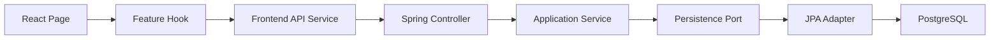

# NoHome 리팩토링 아키텍처

이 문서는 NoHome을 자소서와 면접에서 설명할 수 있도록, 리팩토링의 의도와 현재 구조를 기록한다.

## 목표

- 프론트엔드를 `page -> hook -> service` 흐름으로 구성한다.
- 백엔드를 `controller -> application service -> persistence port -> JPA adapter` 흐름으로 구성한다.
- MyBatis XML과 직접적인 Mapper 의존을 제거하고 JPA 기반 영속성 계층으로 전환한다.
- 스키마 변경은 Flyway 이력으로 관리한다.
- 기능을 유지하면서 책임, 테스트 경계, 코드 흐름을 명확하게 만든다.

## 전체 요청 흐름



프론트엔드는 화면과 상태/API 호출을 분리하고, 백엔드는 비즈니스 흐름과 저장 기술을 분리한다. 서비스가 JPA 구현체 대신 port 인터페이스에 의존하므로 의존성 방향은 애플리케이션 안쪽을 향한다.

## 프론트엔드

```text
Frontend/src/
  components/   재사용 UI와 layout
  pages/        라우트별 화면 조립
  hooks/        화면 상태와 유스케이스 orchestration
  services/     HTTP API와 외부 SDK 접근
  context/      인증 등 전역 상태
  utils/        순수 계산과 표시 변환
```

주요 분리 내용:

- `App.jsx`는 provider와 최상위 layout만 조립한다.
- `useAppController`가 검색, 지도, 회원, 관심 지역, 공지, AI 명령을 연결한다.
- `useHouseSearch`는 검색 흐름을 담당하고 법정동과 가격 범위는 `useLegalDongs`, `usePriceRange`로 분리했다.
- 검색 표시 계산은 순수 함수인 `houseSearchViewModel`로 이동해 React 없이 테스트할 수 있다.
- 계정 화면은 로그인, 가입, 비밀번호 재설정, 프로필, 탈퇴 컴포넌트로 나눴다.
- 관리자 회원 검색은 `useMemberAdminSearch`로 분리했다.
- 채팅은 `useChatConversation`, `useResizableChatPanel`, 표시 컴포넌트로 나눴다.

면접 설명 포인트: 페이지가 직접 HTTP를 호출하지 않는다. hook은 유스케이스 상태를 관리하고 service는 통신 세부사항을 숨기며, 순수 계산은 util로 분리해 빠른 단위 테스트를 가능하게 했다.

## 백엔드

백엔드는 기능별 패키지를 유지하면서 다음 역할을 구분한다.

- Controller: HTTP 입력 검증과 응답 형식
- Service: 트랜잭션과 유스케이스 순서
- Persistence port: 서비스가 요구하는 저장소 계약
- JPA adapter/repository: EntityManager, Spring Data JPA, native SQL 구현
- DTO/entity: API 계약과 영속 상태

MyBatis 전환 과정에서 XML mapper와 MyBatis 설정을 제거했다. 서비스가 과거 Mapper 타입을 직접 참조하지 않도록 `HousePersistencePort`, `MemberPersistencePort`, `NoticePersistencePort` 같은 기능별 port를 도입했다.

복잡한 검색과 PostgreSQL upsert는 무리하게 JPQL로 바꾸지 않았다. JPA `EntityManager` 아래에서 native SQL을 사용하되, SQL 조립과 row mapping을 adapter 내부에 캡슐화했다. 이는 “JPA 사용”을 “모든 쿼리를 JPQL로 작성”과 혼동하지 않고 조회 특성에 맞는 도구를 선택한 결정이다.

## 주택 검색 책임 분리

- `HouseSearchConditionFactory`: 요청 조건 정규화와 검증
- `HouseAutoImportCoverage`: 누락 데이터 판단과 자동 import
- `HouseService`: 검색 유스케이스 조립과 응답 생성
- `HousePersistencePort`: 서비스가 필요한 조회 계약
- `JpaHouseQueryAdapter`: DB 조회 구현
- `HouseSearchNativeSql`: 동적 검색 SQL과 parameter binding
- `HouseRowMappers`: native query 결과를 DTO로 변환

공공데이터 실시간 검색도 외부 API 페이지 수집은 `PublicDataLivePageFetcher`, 필터·정렬·페이지 응답은 `LiveHouseSearchResultProcessor`가 담당한다.

## 트랜잭션

- 조회 서비스는 `@Transactional(readOnly = true)`를 기본으로 사용한다.
- 등록, 수정, 삭제 메서드만 쓰기 트랜잭션으로 재정의한다.
- 관심 지역 조회는 `@EntityGraph`로 연관 지역을 명시적으로 로딩해 OSIV 비활성화 상태에서도 안전하다.
- `spring.jpa.open-in-view=false`로 웹 계층의 지연 로딩 의존을 막는다.

## 데이터베이스 마이그레이션

- `db/migration/V1__initial_schema.sql`이 최초 스키마 이력이다.
- `spring.jpa.hibernate.ddl-auto=none`이므로 Hibernate는 스키마를 변경하지 않는다.
- `spring.sql.init.mode=never`이므로 `schema.sql`/`data.sql` 자동 실행에 의존하지 않는다.
- Docker Compose도 `/docker-entrypoint-initdb.d`를 마운트하지 않는다.
- PostgreSQL은 빈 새 볼륨에서 V1부터 적용하며 알 수 없는 기존 스키마의 자동 baseline은 허용하지 않는다.
- 이후 변경은 기존 V1을 수정하지 않고 `V2__...sql`, `V3__...sql`처럼 추가한다.

운영과 테스트 모두 Flyway migration을 스키마의 단일 기준으로 사용한다. 기본 관리자나 데모 공지는 migration에 넣지 않는다.

## 테스트 전략

- 프론트 순수 함수: Node test
- 프론트 컴포넌트 동작: Vitest + Testing Library + jsdom
- 백엔드 서비스: mock 기반 단위 테스트
- JPA adapter: Testcontainers PostgreSQL 통합 테스트
- 애플리케이션 context: Flyway V1 적용과 Spring wiring 확인

## 자소서 요약 예시

Vue 프론트엔드를 React로 전환하면서 페이지, 상태 hook, API service, 순수 변환 util로 책임을 분리했습니다. 백엔드는 MyBatis XML 의존을 제거하고 application service가 persistence port에 의존하도록 변경했으며, JPA adapter에서 Spring Data JPA와 복잡한 native query를 캡슐화했습니다. 주택 검색과 공공데이터 수집의 조건 생성, 외부 API paging, 결과 가공 책임을 분리했고, Flyway를 도입해 DB 스키마를 버전 관리했습니다. 단위·컴포넌트·JPA 통합 테스트로 리팩토링 전 동작을 보호했습니다.

## 면접에서 설명할 한계와 다음 단계

- `JpaPublicDataImportAdapter`와 batch persist 서비스는 여전히 크므로 command별 adapter 또는 JDBC batch 전략을 검토할 수 있다.
- `HouseService`의 조회 응답 조립은 검색 유스케이스가 더 늘면 query service로 분리할 수 있다.
- 현재 frontend routing은 상태 기반이다. URL 공유와 브라우저 history가 중요해지면 React Router 도입이 다음 단계다.
- PostgreSQL 통합 테스트는 Docker가 필요하므로 CI에서도 Docker 실행 환경을 제공해야 한다.
